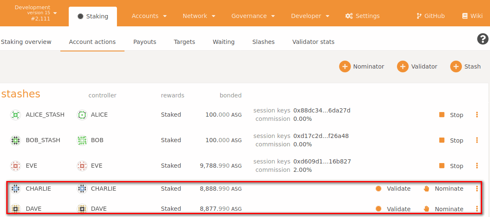
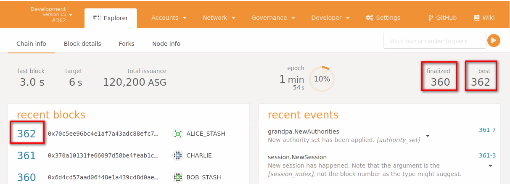
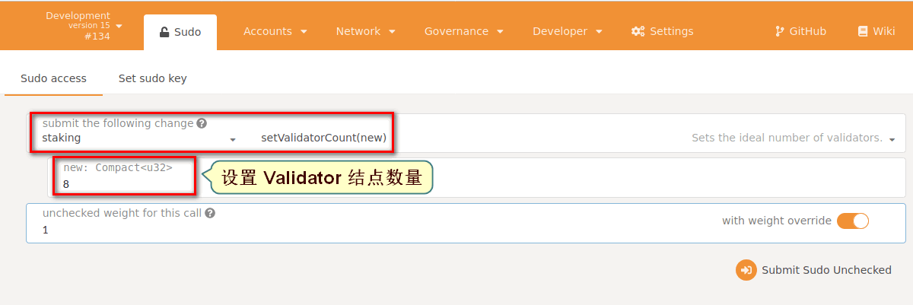
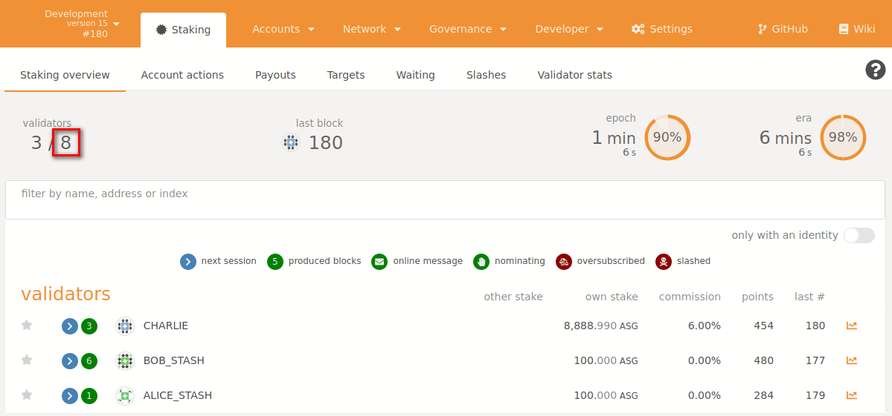

# Bifrost  Staking多结点升级(以六个结点为例) 


## 1. 准备工作  

- ### 1.1 拉取代码

```http
https://github.com/bifrost-finance/bifrost
```

- 	   ### 1.2 进入" bifrost "目录编译		

```
 执行" cargo build --release "编译命令
```

- 	   ### 1.3 清除缓存数据 

```shell
# clear cache
rm -rf /tmp/alice/ \
/tmp/bob/ \
/tmp/charlie/ \
/tmp/dave/ \
/tmp/eve/ \
/tmp/ferdie/
```

- 			### 1.4  在" bifrost "目录下启动 alice 及 bob 结点

```shell
# 在第一个 Terminal 启动 alice 结点
./target/release/bifrost-node \
--base-path /tmp/alice \
--chain=dev \
--alice \
--port 30333 \
--rpc-port 9933 \
--ws-port 9944 \
--unsafe-ws-external \
--rpc-cors all  \
--node-key 0000000000000000000000000000000000000000000000000000000000000001 \
--validator

# 在第二个 Terminal 窗口启动 bob 结点
./target/release/bifrost-node \
--base-path /tmp/bob \
--chain=dev \
--bob \
--bootnodes /ip4/127.0.0.1/tcp/30333/p2p/12D3KooWEyoppNCUx8Yx66oV9fJnriXwCcXwDDUA2kj6vnc6iDEp \
--port 30334 \
--rpc-port 9934 \
--ws-port 9945 \
--validator

# 在第三个 Terminal 窗口启动 charlie 结点
./target/release/bifrost-node \
--base-path /tmp/charlie \
--chain=dev \
--charlie \
--port 30335 \
--rpc-port 9935 \
--ws-port 9946 \
--bootnodes /ip4/127.0.0.1/tcp/30333/p2p/12D3KooWEyoppNCUx8Yx66oV9fJnriXwCcXwDDUA2kj6vnc6iDEp \
--validator

# 在第四个 Terminal 窗口启动 dave 结点
./target/release/bifrost-node \
--base-path /tmp/dave \
--chain=dev \
--dave \
--port 30336 \
--rpc-port 9936 \
--ws-port 9947 \
--bootnodes /ip4/127.0.0.1/tcp/30333/p2p/12D3KooWEyoppNCUx8Yx66oV9fJnriXwCcXwDDUA2kj6vnc6iDEp \
--validator

# 在第五个 Terminal 窗口启动 eve 结点
./target/release/bifrost-node \
--base-path /tmp/eve \
--chain=dev \
--eve \
--port 30337 \
--rpc-port 9937 \
--ws-port 9948 \
--bootnodes /ip4/127.0.0.1/tcp/30333/p2p/12D3KooWEyoppNCUx8Yx66oV9fJnriXwCcXwDDUA2kj6vnc6iDEp \
--validator

# 在第六个 Terminal 窗口启动 ferdie 结点
./target/release/bifrost-node \
--base-path /tmp/ferdie \
--chain=dev \
--ferdie \
--port 30338 \
--rpc-port 9938 \
--ws-port 9949 \
--bootnodes /ip4/127.0.0.1/tcp/30333/p2p/12D3KooWEyoppNCUx8Yx66oV9fJnriXwCcXwDDUA2kj6vnc6iDEp \
--validator

```

- ### 1.5 前端远程访问

     ##### 1.5.1  启动 apps 访问并设置为本地结点如下图


#####      1.5.2  此时若发现前端页面无法加载节点的数据，则需把 developer_setting.json 文件内容拷贝至下图位置


## 2. 添加 Validator 结点

### 2.1 编辑并添加 Validator 结点(以添加 charlie 为例)如图


**登录远程获取 key 并拷贝 result 的值如图**(**注:" 9935 "对应启动 charlie 结点时的端口**)


```shell
curl -H "Content-Type: application/json" -d '{"id":1, "jsonrpc":"2.0", "method": "author_rotateKeys", "params":[]}' http://localhost:9935
```


### 2.2 提交后回到 Staking overview 页面观察其变化：


### 2.3 停止运行的 Validator 结点



### 2.4当停止运行的结点时查看 finalized 及 best 数量变化：

- **best : 最佳出块高度**

- **finalized : 最终出块高度**

  


## 3. 解决 finalize 卡停现象

#### 3.1 访问前端设置如下


#### 3.2 设置后提交并于网页端查看变化情况

- **提交后再次于" Network ->   Explorer -> Chain info " 等待并查看 " finalized 及 best  "如：**

  

## 3. 设置 validator 结点数量

#### 3.1 前端访问并查看 validator 数量


#### 3.2 设置数量后提交



**再次于网页端查看变化情况**



